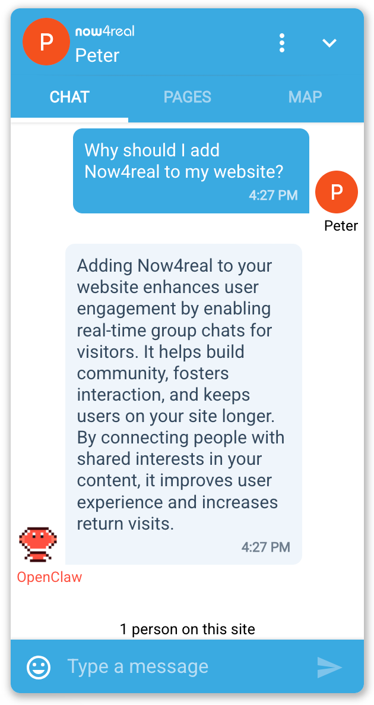
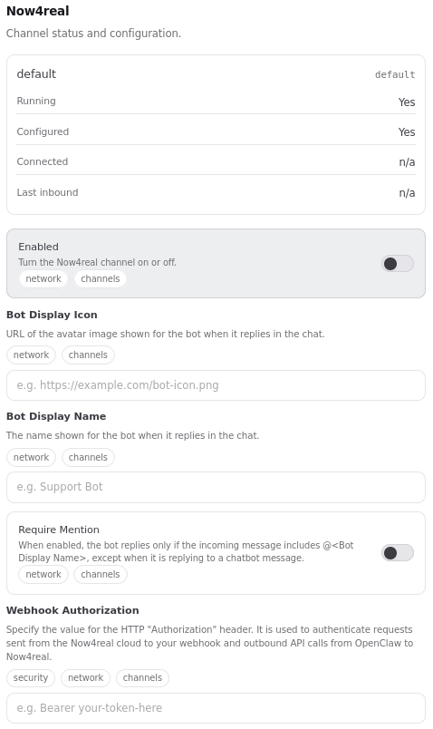

# OpenClaw Now4real Channel

Open-source Now4real channel plugin for OpenClaw. It connects Now4real pagechats to OpenClaw through inbound webhooks and outbound chatbot APIs, with mention-aware replies and markdown-safe message chunking.

## Overview

### What is Now4real?

[Now4real](https://www.now4real.com) is a **live chat widget you embed in your website**. It gives every page of your site its own chat room, visible to all visitors currently on that page. Think of it as a conversation layer that lives on top of your existing content: a visitor opens your blog post, your product page, or your docs, and finds a chat box where they can talk to whoever else is on that same page right now.

You install it by adding a small JavaScript snippet to your site — no backend changes needed. From that moment on, every page on your domain gets a live chat powered by Now4real's infrastructure.

### Why use Now4real as an OpenClaw channel?

With this plugin, **OpenClaw is present inside that chat as an AI assistant**. Visitors on your site can type a question in the Now4real widget and receive an instant, contextual reply from your OpenClaw agent — without leaving the page, without signing up, without any friction.

This is particularly useful in scenarios like:

- **Documentation / knowledge base** — a visitor reading your docs asks a clarifying question directly in the page chat and gets a precise answer from an agent trained on your content.
- **E-commerce product pages** — a shopper asks about compatibility, sizing, or availability and the agent replies instantly, reducing drop-off.
- **Support portals** — users get first-line triage from the AI before being escalated to a human agent.
- **SaaS onboarding pages** — new users ask setup questions and the agent guides them step by step, right inside the product.

The chat lives **on your site**, in a widget that looks and feels native to your brand. Visitors never leave your page to interact with the assistant.

### How it looks

A visitor types a message in the Now4real widget on your page, and OpenClaw replies as a named bot:

<picture>
  <source srcset="doc/img/chat.png" type="image/png">
  
</picture>

The channel is configured and monitored from the OpenClaw dashboard:

<picture>
  <source srcset="doc/img/openclaw-channel.png" type="image/png">
  
</picture>

## Install

From ClawHub:

```bash
openclaw plugins install clawhub:openclaw-now4real
```

Or from GitHub:

```bash
git clone https://github.com/now4real/openclaw-now4real.git
openclaw plugins install openclaw-now4real
```

## Configure

Add this to your OpenClaw config:

```jsonc
{
  "channels": {
    "now4real": {
      "enabled": true,
      "webhookAuthorization": "your-webhook-secret",
      "openClawDisplayName": "OpenClaw",
      "openClawDisplayIcon": "https://raw.githubusercontent.com/openclaw/openclaw/refs/heads/main/assets/chrome-extension/icons/icon48.png",
      "requireMention": false
    }
  }
}
```

Required fields:
- `enabled`
- `webhookAuthorization`

Optional fields:
- `openClawDisplayName` (default: OpenClaw)
- `openClawDisplayIcon` (default: not set)
- `requireMention` (default: false)

`openClawDisplayIcon` is the HTTPS URL for chat. If `openClawDisplayIcon` is not provided, Now4real chat shows the bot initials based on openClawDisplayName.

When `requireMention` is true, the plugin replies only if:
- the incoming message contains a mention of the bot display name (for example: Hello @OpenClaw), or
- the incoming message is a reply to a previous chatbot message.

When an outbound reply is longer than 1000 characters, the plugin automatically splits it into multiple messages using OpenClaw native markdown-aware chunking.

## Environment Variables

The plugin supports this environment variable:

- `OPENCLAW_NOW4REAL_API_URL` (optional)
  - Override URL for Now4real API calls.
  - Default: `https://integrator-api.now4real.com`

## Now4real Dashboard Setup

### Step 1 — Create a free Now4real account

Go to https://dashboard.now4real.com/#/signup/step1 and create a free account. No credit card required.

### Step 2 — Add the Now4real widget to a web page

Now4real needs a real web page on a public URL to attach its chat widget to. Once a visitor opens that page, the chat box appears and your OpenClaw agent can reply there.

**If you already have a website**, add this single line before the closing `</body>` tag of any page you want the chat on:

```html
<script async src="https://cdn.now4real.com/now4real.js"></script>
```

That's it — no other backend changes needed. Now4real activates automatically on every page that includes this snippet.

**If you don't have a site yet**, you can spin one up in minutes using [GitHub Pages](https://pages.github.com):

1. Create a new public GitHub repository named `<your-username>.github.io`.
2. Add an `index.html` file with the snippet included. See [doc/pages/index.html](doc/pages/index.html) for a minimal example.

```html
<!DOCTYPE html>
<html lang="en">
<head>
  <meta charset="UTF-8">
  <title>My OpenClaw Demo</title>
</head>
<body>
  <h1>Hello!</h1>
  <script async src="https://cdn.now4real.com/now4real.js"></script>
</body>
</html>
```

3. In the repository settings, go to **Pages** and set the source to the `main` branch, root folder.
4. GitHub publishes the page at `https://<your-username>.github.io` within a minute or two.

Open that URL in your browser, the Now4real chat bubble should appear.

### Step 3 — Register your site and configure the chatbot

Once your page is live, open the Now4real Dashboard at https://dashboard.now4real.com and complete the chatbot setup:

1. Add your site's URL (e.g. `https://<your-username>.github.io`) if it is not already listed.
2. Open **Site Settings → Chatbots**.
3. Enable the chatbot activation toggle.
4. Set **Webhook endpoint** to:
   `https://your-openclaw-server.example.com/now4real/webhook`
5. Enter the same webhook authorization secret configured in OpenClaw (`channels.now4real.webhookAuthorization`).
6. Click **Test** to verify that Now4real can reach your webhook.
7. If the test succeeds, click **Publish**.

After publishing, your chatbot is live and incoming messages are forwarded to the OpenClaw webhook.

## Features

- Webhook-based inbound delivery to /now4real/webhook
- Outbound replies through Now4real chatbot message API
- Typing indicator lifecycle management during agent response generation
- Context and user included in both message and typing API payloads
- Mention-gated replies with requireMention
- Reply-to-chatbot exception to avoid blocking threaded follow-ups
- Markdown-aware chunking for long outbound replies (1000 chars max per chunk)

## Runtime Flow

1. A visitor sends a message in Now4real pagechat.
2. Now4real sends webhook event data to /now4real/webhook.
3. The plugin validates the Authorization header against webhookAuthorization.
4. The event is dispatched to OpenClaw.
5. On reply start, the plugin calls typing API with context and bot user.
6. On reply completion, the plugin turns typing off.
7. The final agent response is sent through Now4real message API with context, user, and newMessages.

## Requirements

- OpenClaw 2026.4.11+
- OpenClaw must expose a public HTTPS URL and respond on /now4real/webhook
- A configured Now4real site with chatbot/webhook access
